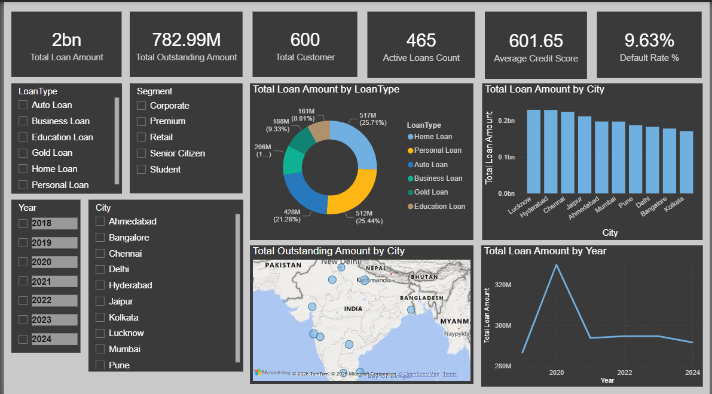

# 🏦 Banking Loan Analytics Dashboard

## 📊 Project Overview
An interactive Power BI dashboard analyzing banking loan data with risk assessment, customer segmentation, and transaction analysis across 600+ customers and 800+ loans.

## 🎯 Business Problem
Banks need to monitor loan default risk, track outstanding amounts, and understand customer segments to make better lending decisions.

## 📸 Dashboard Preview

## ✨ Key Features
- **3-Page Interactive Dashboard** — Overview, Loan Risk Analysis, Customer Details
- **Drill-through** — Click any segment to see customer-level details
- **Dynamic Slicers** — Filter by Year, City, Loan Type, Segment
- **10+ DAX Measures** — Default Rate %, YoY Growth, Outstanding Amount
- **Star Schema Data Model** — 4 tables with proper relationships

## 📈 Key Insights
- Total Loan Portfolio: **₹2 Billion**
- Total Outstanding Amount: **₹782.99M**
- Default Rate: **9.63%**
- Active Loans: **465**
- Average Credit Score: **601.65**

## 🛠️ Tech Stack
- **Tool:** Microsoft Power BI Desktop + Power BI Service
- **Data:** Excel (Banking_Dataset.xlsx)
- **DAX:** CALCULATE, DIVIDE, FILTER, AVERAGE, COUNTROWS
- **Power Query:** Folder Connector, Append, Merge, Group By

## 📁 Project Structure

## 🔗 Live Dashboard
[View Live Dashboard on Power BI Service](https://app.powerbi.com/links/MCct7psdpR?ctid=8939c792-e4c2-48e9-a43c-4db3ceb9b165&pbi_source=linkShare) 

## 📋 DAX Measures Used
| Measure | Formula |
|---|---|
| Default Rate % | DIVIDE(CALCULATE(COUNTROWS(Loans), Loans[Status]="Default"), COUNTROWS(Loans)) |
| Total Outstanding | SUM(Loans[OutstandingAmount]) |
| Active Loans Count | CALCULATE(COUNTROWS(Loans), Loans[Status]="Active") |
| Avg Credit Score | AVERAGE(Customers[CreditScore]) |

## 👤 Author
**Sourabh** — Aspiring Data Analyst
